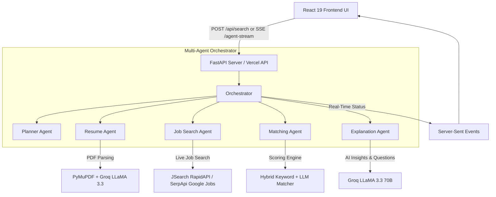

<div align="center">

  <h1>🌊 JobWave Search</h1>
  <p><b>An Agentic AI-Powered Job Discovery & Match Ranking Engine</b></p>

  <p>
    
    
    
    
    
    
    
  </p>

</div>

---

## 📌 Overview

**JobWave Search** (formerly *AI Job Agent*) is an intelligent, multi-agent recruitment platform designed to connect job seekers with tailored career opportunities. Unlike conventional search engines that rely purely on basic keyword matching, JobWave Search utilizes **Groq-powered LLaMA 3.3 (70B)**, a multi-agent orchestration pipeline, and automated PDF resume analysis to match, rank, and explain job fit in real time.

---

## ✨ Key Features

| Feature | Description |
| :--- | :--- |
| 📄 **Smart PDF Resume Parsing** | Extracts skills, target roles, and experience levels directly from uploaded PDF resumes using PyMuPDF and LLaMA 3.3. |
| 🤖 **Multi-Agent Orchestration** | Autonomous agent workflow featuring specialized Planner, Search, Resume, Matching, and Explanation agents. |
| ⚡ **Live Real-Time SSE Streaming** | Streams agent reasoning steps and thinking status via Server-Sent Events (SSE) directly to the user interface. |
| 🎯 **AI Fit Scoring & XAI** | Generates percentage match scores, plain-English explanations of fit, and skill gap analyses. |
| 💡 **Tailored Interview Question Generator** | Automatically crafts custom interview prep questions tailored specifically to each candidate and role. |
| 🔍 **Multi-Provider Job Aggregation** | Fetches live jobs from **JSearch API (RapidAPI)** and **Google Jobs (SerpApi)** with fallback mechanisms. |
| 🎨 **Modern Futuristic UI** | Built with React 19, Framer Motion, and Tailwind CSS v4 featuring dark mode aesthetics and glassmorphism. |
| 🚀 **Vercel Serverless Ready** | Pre-configured with unified frontend build and backend serverless API handlers for instant deployment. |

---

## 🏗️ System Architecture



---

## 🛠️ Technology Stack

### **Backend**
- **Framework**: Python 3.10+, FastAPI, Uvicorn
- **AI / LLM Engine**: Groq API (`llama-3.3-70b-versatile`)
- **PDF Parser**: PyMuPDF (`fitz`)
- **Database & ORM**: SQLite, SQLAlchemy
- **Data Validation**: Pydantic v2
- **External APIs**: RapidAPI (JSearch), SerpApi (Google Jobs)

### **Frontend**
- **Framework**: React 19 (Vite 8)
- **Styling**: Tailwind CSS v4, Framer Motion (Animations), Lucide React (Icons)
- **HTTP Client**: Native Fetch API / Axios

---

## 📂 Project Structure

```
JobWave_Search/
├── api/
│   └── index.py               # Vercel Serverless Function entrypoint
├── backend/
│   ├── agents/                # Multi-Agent implementation
│   │   ├── explanation_agent.py
│   │   ├── job_search_agent.py
│   │   ├── matching_agent.py
│   │   ├── orchestrator.py
│   │   ├── planner_agent.py
│   │   └── resume_agent.py
│   ├── models/                # SQLAlchemy & Pydantic models
│   ├── routes/                # FastAPI endpoints (job_routes, stream_routes)
│   ├── services/              # SSE Stream Manager
│   ├── tools/                 # JSearch API, SerpApi & Resume Analyzer tools
│   └── main.py                # FastAPI main application
├── frontend/
│   ├── src/
│   │   ├── components/        # React components (JobCard, SearchBar, etc.)
│   │   └── App.jsx            # Main dashboard application
│   ├── package.json           # Frontend dependencies
│   └── vite.config.js         # Vite configuration
├── package.json               # Root monorepo script configuration
├── requirements.txt           # Python backend dependencies
└── vercel.json                # Vercel deployment & route rewriting config
```

---

## 🚀 Quick Start Guide

### 1. Clone the Repository
```bash
git clone https://github.com/SantoshRM-1/JobWave_Search.git
cd JobWave_Search
```

### 2. Environment Setup
Create a `.env` file in the root directory:
```env
# AI Models Key
GROQ_API_KEY=gsk_your_groq_api_key_here

# Job Search APIs (Choose either or both)
SERP_API_KEY=your_serpapi_key_here
RAPIDAPI_KEY=your_rapidapi_key_here
```

### 3. Start Backend Server
```bash
# Create and activate virtual environment
python -m venv venv
# Windows:
.\venv\Scripts\activate
# Mac/Linux:
# source venv/bin/activate

# Install dependencies
pip install -r requirements.txt

# Start FastAPI server
uvicorn backend.main:app --reload --port 8000
```

### 4. Start Frontend Client
In a new terminal tab:
```bash
cd frontend
npm install
npm run dev
```

Open your browser at `http://localhost:5173`.

---

## ☁️ Deployment on Vercel

This repository is optimized for one-click deployment on **Vercel**.

1. Import your GitHub repository (`SantoshRM-1/JobWave_Search`) into **Vercel**.
2. Set **Root Directory** to `.` (leave default root).
3. Add your Environment Variables (`GROQ_API_KEY`, `SERP_API_KEY`, etc.) in Vercel Project Settings.
4. Deploy! Vercel will automatically build the React frontend and deploy the FastAPI backend as serverless functions.

---

## 📜 License

This project is licensed under the [MIT License](LICENSE).
